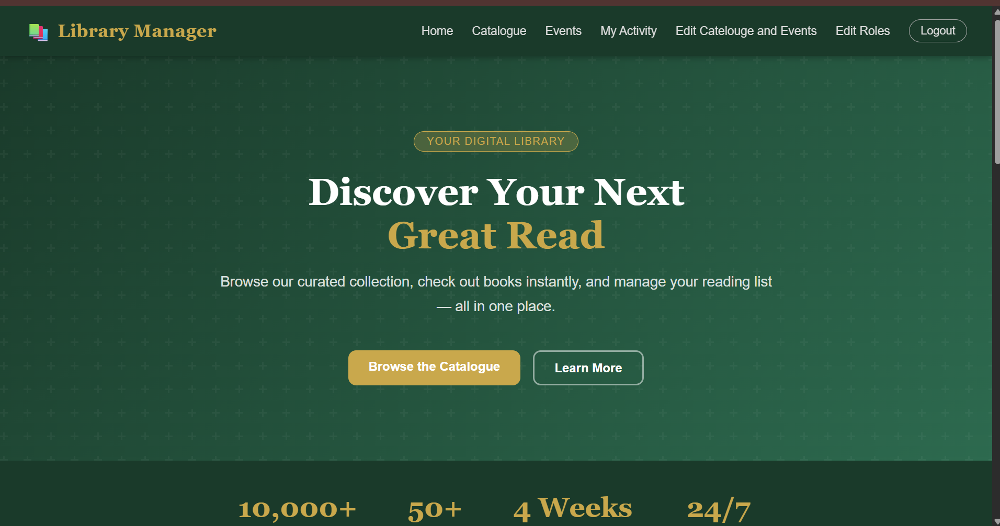
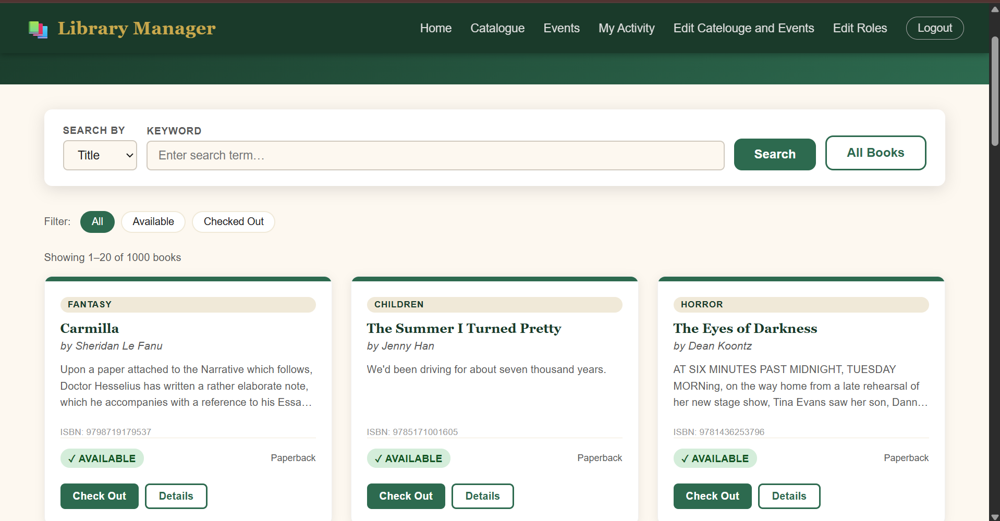
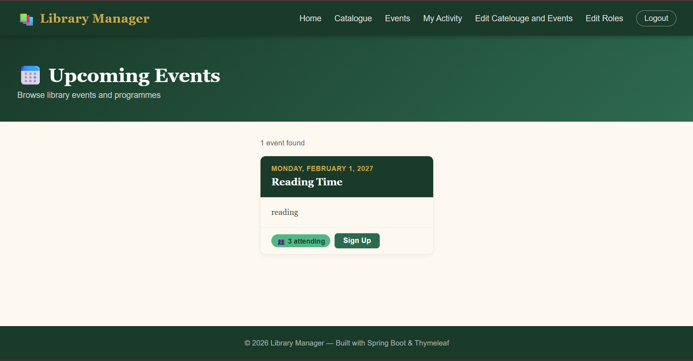
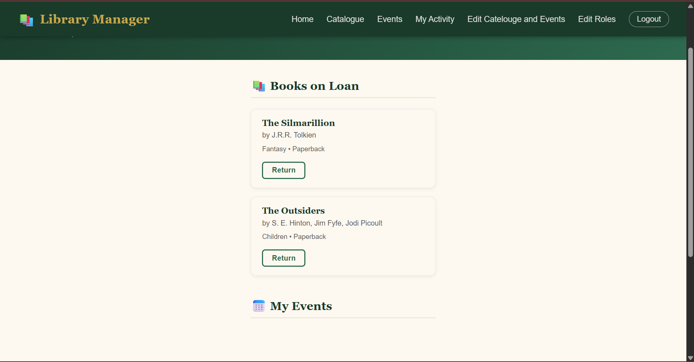
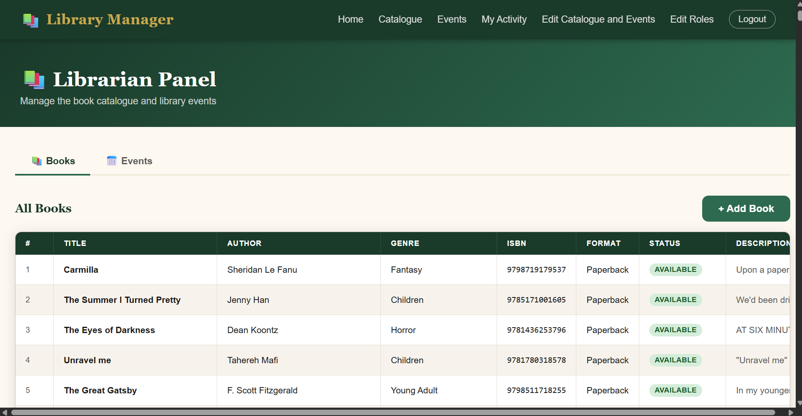
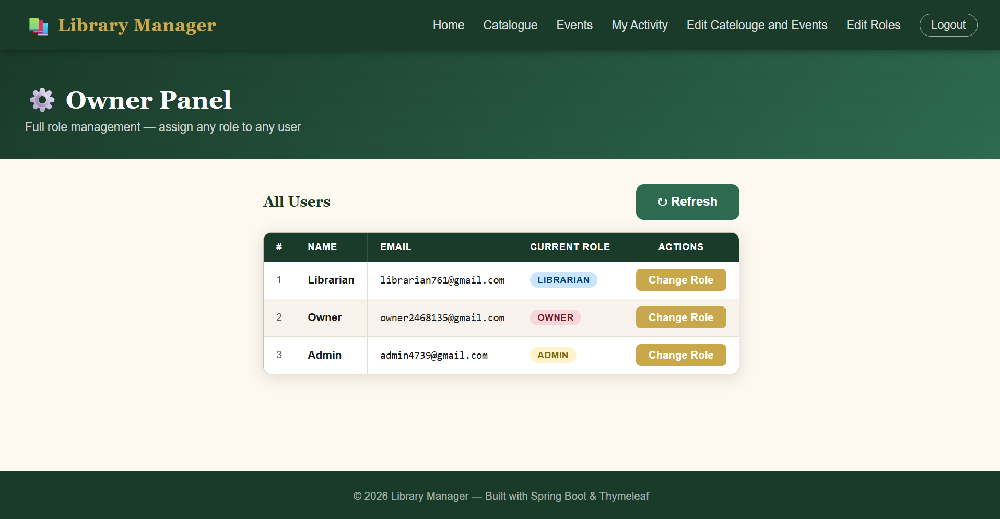

The Virtual Library is a virtual platform which allows users to check out and return books as well as sign up for events. The Web app has all the functionality that a library would need. Users are separated into 4 roles, being USER, LIBRARIAN, ADMIN, and OWNER, all of which have different abilities which affect the website. 

Demo Url: https://virtual-library.tail5b0cb9.ts.net/
___

To run locally, follow the steps bellow(while inside the project file):
- Download Docker
- Use Google console and create project to set up oauth
- enter the client id and client secret from your google console project into the compose.yaml at their needed places
- host or connect to an online database(specifically a postgres) and enter the connect url into compose.yaml
- run in terminal: docker build -t virtuallibrary .
- run in terminal: docker compose up -d
  

---

Photos:

Home Page:

Book Catelouge Searcher:

Event Sign Up Area:

View Your User Activity:

Edit Books and Events(For Owners and Librarians Only):

Role Editor (For Owners and Admins Only):

___
Credentials:

- Authentication is through Google, so sign in to the following Google Accounts to unlock their privileges:

    * Librarian- Email: librarian761@gmail.com Password: librarian123
    * Owner- Email: owner2468135@gmail.com Password: owner@123
    * Admin-Email: admin4739@gmail.com Password: admin@1234
    * User- Just sign into the website using you email as the default role is User